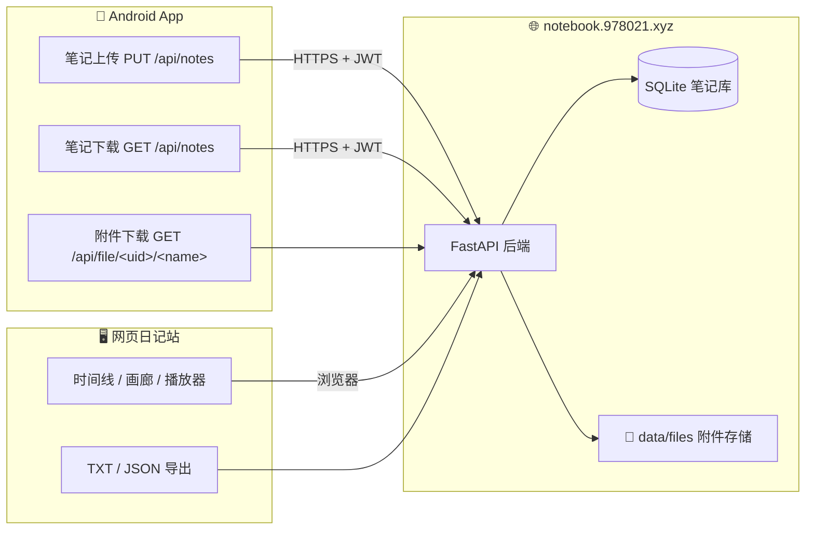

<p align="center">
  
  
  
  
  
  
</p>

<p align="center">
  <strong>🌸 樱花便签 · Sakura Notes</strong>
</p>

<p align="center">
  一款以 <a href="https://github.com/OmGodse/Notally">Notally</a> 为底座二次开发的极简笔记应用 ——<br/>
  <strong>轻量、离线优先、可云同步</strong>，图片与录音附件全量上云，手机 / 网页双端互通。
</p>

---

## ✨ 功能特性

| 类别 | 说明 |
|---|---|
| ☁️ **云同步** | 注册/登录后一键上传、下载全部笔记；**图片/音频附件随笔记同步**（base64 传输 → 服务端落盘 → 下载时自动拉回本地媒体目录） |
| 🌐 **网页日记站** | 手机笔记实时同步到 [notebook.978021.xyz](https://notebook.978021.xyz)，浏览器端时间线浏览、图片画廊、音频播放、TXT/JSON 导出 |
| ✅ **待办清单** | 笔记内嵌复选框清单，勾选即划线 |
| ⏰ **提醒** | 单次 / 每天 / 每周 / 每月 / 每年，通知栏准时提醒 |
| 🖼️ **图片附件** | 支持 JPG / PNG / WEBP，点击全屏查看 |
| 🎙️ **录音附件** | 一键录音、内嵌播放器回放 |
| ✍️ **富文本** | 加粗、斜体、删除线、等宽字体、可点击链接（电话 / 邮箱 / 网址） |
| 🏷️ **组织管理** | 颜色标记、置顶、标签分类、归档、回收站 |
| 🔍 **搜索** | 全笔记即时搜索，笔记内关键词定位 |
| 📱 **桌面小部件** | 多种尺寸小部件，桌面即写即记 |
| 💾 **自动备份** | 定时导出备份，数据不丢失 |
| 🌙 **主题** | 樱花粉主题色，日间 / 夜间模式，支持系统动态取色 |
| 🌍 **多语言** | 完整中文本地化 + 29 种语言 |

## ☁️ 云同步架构



- **传输安全**：全站 HTTPS（Let's Encrypt）+ JWT 登录态，附件 URL 按用户隔离
- **服务器**：FastAPI + SQLite（`server/main.py`），systemd 常驻，nginx 反代
- **部署**：一键脚本见 `server/notebook-sync.service`、`server/nginx-notebook.conf`

## 📦 安装与构建

### 直接安装
从 [Releases](https://github.com/hinewboy/sakura-notes/releases) 下载最新 APK（约 7.1MB），覆盖安装即可（无需卸载，数据保留）。

### 自行构建

```bash
# 环境要求：JDK 21、Android SDK (compileSdk 36)
./gradlew assembleDebug
```

APK 输出：`app/build/outputs/apk/debug/app-debug.apk`

## 🧱 技术栈

| 端 | 技术 |
|---|---|
| Android | Kotlin · Room · Coroutines · Glide · Material Design · 原生 ViewBinding |
| 服务端 | Python · FastAPI · SQLite · nginx · Let's Encrypt |

## 📜 版本记录

| 版本 | 内容 |
|---|---|
| **v6.3** | ☁️ 云同步上线：附件（图片/录音）全量上传下载、网页日记站、注册登录；修复下载后附件丢失 |
| v6.2 | 樱花主题定制：应用名/图标/主题色中文化，补齐 51 条中文翻译 |

## 🙏 致谢

- 上游项目 [OmGodse/Notally](https://github.com/OmGodse/Notally)（v6.2，GPL v3），原版可在 Google Play 与 F-Droid 获取
- 本项目为个人定制 fork，与上游保持独立演进

## 📄 许可

**GPL v3** — 与上游 Notally 一致。详见 [LICENSE.md](LICENSE.md)。
